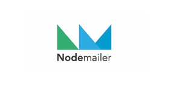
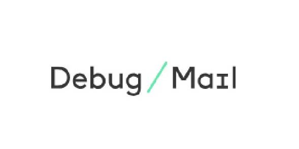
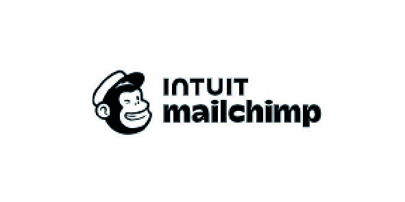
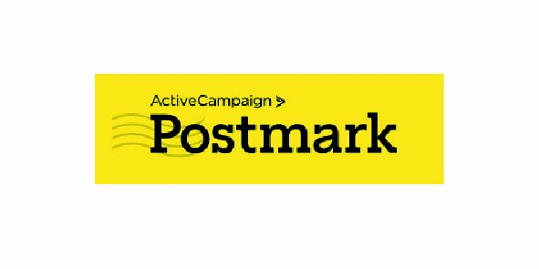
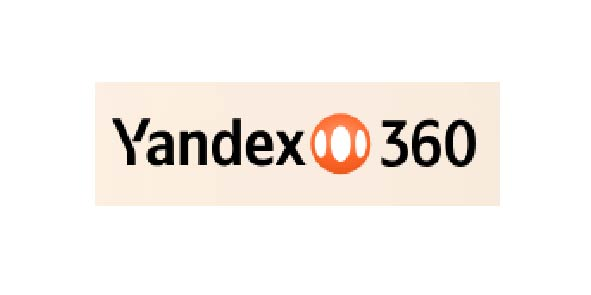

A modular 2FA Authentication base digital solution to start your web/app enhanced with IA, that uses Email or SMS as second step item receiver

# Repositories composition

[stepByStep-starter-kit](https://github.com/hectorserranodelafuente/stepByStep-starter-kit).

[stepByStep](https://github.com/hectorserranodelafuente/stepByStep).

[stepByStep-front-vanilla-theme-default](https://github.com/hectorserranodelafuente/stepByStep-front-vanilla-theme-default).

[stepByStep-back-node-sqlite](https://github.com/hectorserranodelafuente/stepByStep-back-node-sqlite)

[stepByStep-plugin-sms-labsMobile](https://github.com/hectorserranodelafuente/stepByStep-plugin-sms-labsMobile).

[emulate](https://github.com/hectorserranodelafuente/emulate).

## SMS providers

|  Available   | Future Developments |
|:-------------|:-------------|
| [https://www.labsmobile.com/](https://www.labsmobile.com/) |           | 
|  | **Modular property** and **SMS plugin pattern** let´s Step-By-Step increase easily the number of other SMS plugin providers |

## Email providers

|    |
|:-------------|
||
| Step by Step integrates nodeMailer so it allows to use a high number of email providers|
| [https://nodemailer.com](https://nodemailer.com) |

### Verified email provider

|    |
|:-------------|
||
| [https://ionos.com](https://ionos.com) |

### Non Verified email provider 

||   |  |
| | |   |
|| |   |
|| |   |
|| |   |
|| |   |
|| |   |
|| |  |

